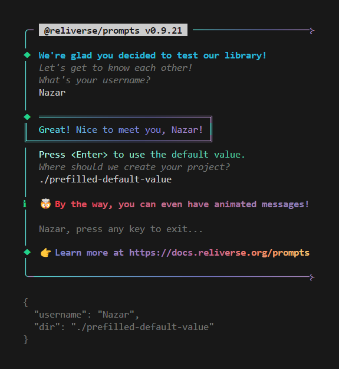

# Reliverse Prompts

[**Docs**](https://docs.reliverse.org/prompts) | [**npmjs.com**](https://npmjs.com/package/@reliverse/prompts) | [**GitHub**](https://github.com/reliverse/prompts)

[](https://docs.reliverse.org/prompts)

@reliverse/prompts is a powerful library that enables seamless, type-safe, and resilient prompts for command-line applications. Crafted with simplicity and elegance, it provides developers with an intuitive and robust way to build interactive CLIs.

[](https://docs.reliverse.org/prompts)

## Installation

Install with your preferred package manager:

```sh
bun add @reliverse/prompts # Replace 'bun' with npm, pnpm, or yarn if desired (deno and jsr support coming soon)
```

## Key Features

- **Type Safety**: Built with TypeScript, ensuring strong typing to prevent runtime errors.
- **Schema Validation**: Validates user inputs using schemas for enhanced reliability.
- **Flexible Prompt Types**: Supports a range of prompt types, including text, password, number, select, and multiselect.
- **Crash Resilience**: Designed to handle cancellations and errors gracefully, ensuring stability.

[](https://docs.reliverse.org/prompts)

## Prompt Types

Each type has its own validation and display logic. More types are planned for future releases.

- **Text**: Collects text input.
- **Password**: Hidden input for secure password entries.
- **Number**: Numeric input with optional validation.
- **Confirm**: Simple Yes/No prompt.
- **Select**: Dropdown selection for multiple choices.
- **Multiselect**: Allows users to select multiple items from a list.

[](https://docs.reliverse.org/prompts)

## Input Validation

All prompts support custom validation logic, providing immediate feedback to users.

[](https://docs.reliverse.org/prompts)

## Contributing

@reliverse/prompts is a work in progress. We welcome feedback and contributions to help make it the best library it can be. Thank you!

Here is how to install the library for development:

```sh
git clone https://github.com/reliverse/prompts.git
cd prompts
bun i
```

## Playground

Run `bun dev` to launch the [examples/run-example.ts](./examples/run-example.ts) CLI, where you can dive into and explore any of the examples listed below. Experiment with @reliverse/prompts by running examples locally or reviewing the linked code:

1. **[1-main-example.ts](./examples/1-main-example.ts)**: A comprehensive example of a CLI application featuring a well styled UI config. This example showcases all available prompt components, with code organized into separate functions and files for better readability and clarity.
2. **[2-mono-example.ts](./examples/2-mono-example.ts)**: A quiz game example inspired by Fireship's [video](https://youtube.com/watch?v=_oHByo8tiEY). It demonstrates the dynamic capabilities of @reliverse/prompts by using a prompt() that includes all prompt components, so you don't need to import each component separately.
3. **[3-basic-example.ts](./examples/3-basic-example.ts)**: A simple example highlighting the core functionalities of @reliverse/prompts. The entire implementation is contained within a single file for easy understanding.

## Prompts Library Comparison

> **Note:** This table contains approximate and placeholder values. More detailed assessments will be provided as libraries continue to evolve.

**Icon Legend:**

- 🟡: Not yet verified
- 🟢: Fully supported
- 🔵: Partially supported
- 🔴: Not supported

| **Feature**                                   | **@reliverse/prompts**                             | **@inquirer/prompts**  | **@clack/prompts**  | **@terkelg/prompts**         | **@cronvel/terminal-kit**   | **@unjs/consola** |
|-----------------------------------------------|----------------------------------------------------|------------------------|---------------------|------------------------------|-----------------------------|-------------------|
| **Full Node.js Modules Support**              | 🟢 ESM-only                                        | 🟡                    | 🟡                  | 🔴 CJS-only                 | 🔴 CJS-only                 | 🟡               |
| **Codebase typesafety with intellisense**     | 🔵                                                 | 🟡                    | 🟡                  | 🟡                          | 🟡                          | 🟡               |
| **Runtime typesafety with schema validation** | 🟢 TypeBox + Custom                                | 🟡                    | 🟡                  | 🟡                          | 🟡                          | 🟡               |
| **Usage Examples**                            | 🟢                                                 | 🟡                    | 🟡                  | 🟡                          | 🟡                          | 🟡               |
| **All-in-one prompts()**                      | 🟢 Separate + All-in-one                           | 🟡                    | 🟡                  | 🟢 Separate(?) + All-in-one | 🟡                          | 🟡               |
| **Start Component**                           | 🟢                                                 | 🟡                    | 🟡                  | 🟡                          | 🟡                          | 🟡               |
| **Text Component**                            | 🟢                                                 | 🟡                    | 🟡                  | 🟡                          | 🟡                          | 🟡               |
| **Customization**                             | 🟢 Colors, Typography, Border, Variants, and more  | 🟡                    | 🟡                  | 🟡                          | 🟡                          | 🟡               |
| **Title Animations**                          | 🟢 Includes 6 animations                           | 🟡                    | 🟡                  | 🟡                          | 🟡                          | 🟡               |
| **ASCII Art Component**                       | 🟢 Includes 290 fonts                              | 🟡                    | 🟡                  | 🟡                          | 🟡                          | 🟡               |
| **Password Component**                        | 🟡                                                 | 🟡                    | 🟡                  | 🟡                          | 🟡                          | 🟡               |
| **Number Component**                          | 🟡                                                 | 🟡                    | 🟡                  | 🟡                          | 🟡                          | 🟡               |
| **Confirm Component**                         | 🟡                                                 | 🟡                    | 🟡                  | 🟡                          | 🟡                          | 🟡               |
| **Select Component**                          | 🟡                                                 | 🟡                    | 🟡                  | 🟡                          | 🟡                          | 🟡               |
| **Multiselect Component**                     | 🟡                                                 | 🟡                    | 🟡                  | 🟡                          | 🟡                          | 🟡               |
| **ProgressBar Component**                     | 🟡                                                 | 🟡                    | 🟡                  | 🟡                          | 🟢                          | 🟡               |
| **Image Component**                           | 🟡                                                 | 🟡                    | 🟡                  | 🟡                          | 🟢                          | 🟡               |
| **Custom Validation**                         | 🟡                                                 | 🟡                    | 🟡                  | 🟡                          | 🟡                          | 🟡               |
| **Error Handling**                            | 🟡                                                 | 🟡                    | 🟡                  | 🟡                          | 🟡                          | 🟡               |
| **Ease of Setup**                             | 🟡                                                 | 🟡                    | 🟡                  | 🟡                          | 🟡                          | 🟡               |
| **Crash Resilience**                          | 🟡                                                 | 🟡                    | 🟡                  | 🟡                          | 🟡                          | 🟡               |
| **General DX**                                | 🔵 Clean TS code understandable for anyone         | 🟡                    | 🟡                  | 🔴 JS-only                  | 🔴 JS-only                  | 🟡               |
| **DX: Classes**                               | 🟢 Zero classes                                    | 🟡                    | 🟡                  | 🟡                          | 🟡                          | 🟡               |
| **Documentation**                             | 🟡                                                 | 🟡                    | 🟡                  | 🔵                          | 🟢                          | 🟡               |
| **Designed With UX in Mind**                  | 🔵                                                 | 🟡                    | 🟡                  | 🟡                          | 🟡                          | 🟡               |

**Related Links**: [ESM/CJS](https://dev.to/iggredible/what-the-heck-are-cjs-amd-umd-and-esm-ikm), ["Pure ESM package"](https://gist.github.com/sindresorhus/a39789f98801d908bbc7ff3ecc99d99c), [Clean code](https://github.com/ryanmcdermott/clean-code-javascript#readme), ["UX patterns for CLI tools"](https://lucasfcosta.com/2022/06/01/ux-patterns-cli-tools.html), [DX (Developer Experience)](https://github.blog/enterprise-software/collaboration/developer-experience-what-is-it-and-why-should-you-care), [TypeBox](https://github.com/sinclairzx81/typebox#readme)

## Special Thanks

This project wouldn’t exist without the amazing work of the following projects:

- [@inquirer/prompts](https://github.com/SBoudrias/Inquirer.js#readme)
- [terkelg/prompts](https://github.com/lu-jiejie/prompts-plus#readme#readme)
- [@clack/prompts](https://github.com/bombshell-dev/clack#readme)
- [create-t3-app](https://github.com/t3-oss/create-t3-app#readme)
- [create-astro](https://github.com/withastro/astro/tree/main/packages/create-astro#readme)
- [cronvel/terminal-kit](https://github.com/cronvel/terminal-kit#readme)
- [unjs/consola](https://github.com/unjs/consola#readme)

## Wrap-Up

@reliverse/prompts is a versatile library designed to accelerate CLI development by providing customizable prompt components. Integrated into the [Reliverse CLI](https://github.com/blefnk/reliverse#readme), @reliverse/prompts enables you to create a unique design aligned with your CLI app’s aesthetics, similar to how @shadcn/ui supports customizable web UI components. Quickly get started by copying configurations from the [Reliverse Docs](https://docs.reliverse.org/prompts) and using components that fit your project, making it faster to bring your CLI app to life. You’re free to customize each component as desired, with default designs provided to ensure an attractive interface from the start.

**Example Configuration:**

```typescript
const basicConfig = {
  titleColor: "cyanBright",
  titleTypography: "bold",
  borderColor: "viceGradient",
} satisfies OptionalPromptOptions;

const extendedConfig = {
  ...basicConfig,
  contentTypography: "italic",
  contentColor: "dim",
} satisfies OptionalPromptOptions;

const username = await textPrompt({
  id: "username",
  title: "We're glad you're testing our library!",
  content: "Let's get to know each other!\nWhat's your username?",
  schema: schema.properties.username,
  ...extendedConfig,
});
```
