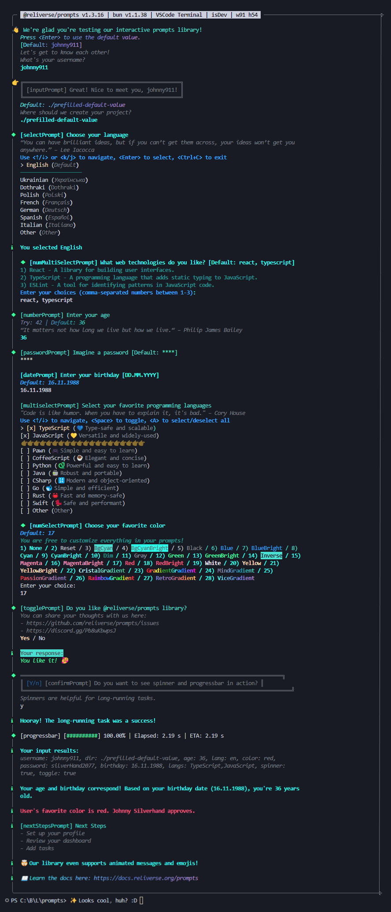

# rempts • powerful js/ts cli builder

> @reliverse/rempts is a modern, type-safe toolkit for building delightful cli experiences. it's fast, flexible, and made for developer happiness. file-based commands keep things simple—no clutter, just clean and easy workflows. this is how cli should feel.

[sponsor](https://github.com/sponsors/blefnk) — [discord](https://discord.gg/Pb8uKbwpsJ) — [repo](https://github.com/reliverse/rempts) — [npm](https://npmjs.com/@reliverse/rempts)

## Features

- 🫂 Rempts prevents you from fighting with your CLI tool
- ✨ Rempts is your end-to-end CLI UI + command framework
- 💪 Made for DX precision and high-context terminal UX
- 📂 File-based commands (app router style by default)
- 🏎️ Prompt engine that *feels* modern, actually is
- 🧠 Type-safe from args to prompts
- ⚡ Blazing-fast, no runtime baggage
- 🧩 Router + argument parser built-in
- 🎨 Customizable themes, styled output
- 🚨 Crash-safe (Ctrl+C, SIGINT, errors)
- 🪄 Minimal API surface, max expressiveness
- 🧪 Scriptable for testing, stable for production
- 🆕 Automatic commands creation (via `dler init --cmd my-cool-cmd`)
- 🏞️ No more hacking together `inquirer`, `citty`, `commander`, `chalk`

## Installation

```bash
bun add @reliverse/rempts
```

**Coming soon**:

```bash
bun i -g @reliverse/dler
dler rempts init --cmd my-cmd-1
dler rempts init --cmds
```

## Usage Examples

- [Prompts](#prompts)
- [Launcher](#launcher)

## Screenshot



## API Overview

All main prompts APIs are available from the package root:

```ts
import {
  // ...prompts
  defineCommand, runMain, defineArgs,
  inputPrompt, selectPrompt, multiselectPrompt, numberPrompt,
  confirmPrompt, togglePrompt, spinnerTaskPrompt, progressTaskPrompt,
  startPrompt, endPrompt, resultPrompt, nextStepsPrompt,
  // ...hooks
  useSpinner,
  // ...launcher
  runMain, defineCommand, defineArgs,
  // ...types
  // ...more
} from "@reliverse/rempts";
```

> See [`src/mod.ts`](./src/mod.ts) for the full list of exports.

## Prompts

### Built-in Prompts

| Prompt                    | Description                                               |
|---------------------------|-----------------------------------------------------------|
| `inputPrompt`             | Single-line input (with mask support, e.g. for passwords) |
| `selectPrompt`            | Single-choice radio menu                                  |
| `multiselectPrompt`       | Multi-choice checkbox menu                                |
| `numberPrompt`            | Type-safe number input                                    |
| `confirmPrompt`           | Yes/No toggle                                             |
| `togglePrompt`            | Custom on/off toggles                                     |
| `progressTaskPrompt`      | Progress bar for async tasks                              |
| `resultPrompt`            | Show results in a styled box                              |
| `nextStepsPrompt`         | Show next steps in a styled list                          |
| `startPrompt`/`endPrompt` | Makes CLI start/end flows look nice                       |
| `spinnerTaskPrompt`       | Async loader with spinner (possibly will be deprecated)   |
| `datePrompt`              | Date input with format validation                         |
| `anykeyPrompt`            | Wait for any keypress                                     |

### Hooks

| Hook         | Description        |
|--------------|--------------------|
| `useSpinner` | Start/stop spinner |

### Notices

- `setup`/`cleanup` are now `onCmdStart`/`onCmdEnd` (old names still work for now).

### Prompts Usage Example

```ts
import { relinka } from "@reliverse/relinka";

import {
  startPrompt,
  inputPrompt,
  selectPrompt,
  defineCommand,
  runMain
} from "@reliverse/rempts";

async function main() {
  await startPrompt({ title: "Project Setup" });

  const name = await inputPrompt({
    title: "What's your project name?",
    defaultValue: "my-cool-project",
  });

  const framework = await selectPrompt({
    title: "Pick your framework",
    options: [
      { value: "next", label: "Next.js" },
      { value: "svelte", label: "SvelteKit" },
      { value: "start", label: "TanStack Start" },
    ],
    defaultValue: "next",
  });

  console.log("Your result:", { name, framework });
};

await main();
```

## Launcher

### Terminology

- **Launcher/Router**: The main entry point for your CLI. Visit [CLI Launcher (Router)](#cli-launcher-router) section to learn more.
- **Command**: A command is a function that defines the inner script launched by the main script where runMain() is used or by some other command.
- **Argument**: An argument is a value that is passed to a command.
- **Flag**: A flag is a boolean argument that is used to enable or disable a feature.
- **Option**: An option is a named argument that is used to configure a command.

#### Launcher Usage Example

```ts
import { relinka } from "@reliverse/relinka";

import { defineCommand, runMain } from "~/mod.js";

const main = defineCommand({
  meta: {
    name: "rempts",
    version: "1.0.0",
    description: "Rempts Launcher Playground CLI",
  },
  onCmdStart() {
    relinka("success", "Setup");
  },
  onCmdEnd() {
    relinka("success", "Cleanup");
  },
  commands: {
    build: () => import("./app/build/cmd.js").then((r) => r.default),
    deploy: () => import("./app/deploy/cmd.js").then((r) => r.default),
    debug: () => import("./app/debug/cmd.js").then((r) => r.default),
  },
});

await runMain(main);
```

```ts
await runMain(myCommand, {
  fileBasedCmds: {
    enable: true,
    cmdsRootPath: "my-cmds", // default is `./app`
  },
  // Optionally disable auto-exit to handle errors manually:
  autoExit: false,
});
```

This flexibility allows you to easily build a rich, multi-command CLI with minimal boilerplate. The launcher even supports nested commands, making it simple to construct complex CLI applications.

#### File-Based Commands

Drop a `./src/cli/app/add/index.ts` and it's live.

```ts
import { defineArgs, defineCommand } from "@reliverse/rempts";
export default defineCommand({
  meta: {
    name: "add",
    version: "1.0.0",
    description: "Add stuff to your project",
  },
  args: {
    name: defineArgs({ // 💡 PRO TIP: use defineArgs() to get fully correct intellisense
      type: "string",
      required: true,
      description: "Name of what to add",
    }),
  },
  async run({ args }) {
    relinka("log", "Adding:", args.name);
  },
});
```

**Supports**:

- `arg-cmdName.{ts,js}`,
- `cmdName/index.{ts,js}`,
- `cmdName/cmdName-mod.{ts,js}`,
- And more — with automatic usage output.

**Hint**:

- Install `bun add -D @reliverse/dler`
- Use `dler init --cmd cmd1 cmd2` to init commands for rempts launcher's automatically

### Advanced Minimal API

```ts
defineCommand({
  meta: { name: "cli", version: "1.0.0" },
  args: {
    name: { type: "string", required: true },
    verbose: { type: "boolean", default: false },
    animals: { type: "array", options: ["cat","dog"] },
  },
  async run({ args, raw }) { // or `async run(ctx)`
    relinka("log", args.name, args.verbose, args.animals); // or `relinka("log", ctx.args.name, ...);`
  },
});
```

**Supports**:

- `positional` args
- `array` types (`--tag foo --tag bar`)
- Default values, validations, descriptions
- Full help rendering from metadata

### Theming + Customization

- Built-in output formatter and logger
- Override styles via prompt options
- Smart layout for small terminals
- Looks great in plain scripts or full CLI apps

### Playground

```bash
bun i -g @reliverse/rempts-cli
rempts examples # supported options: name
```

OR:

```bash
git clone https://github.com/reliverse/rempts
cd rempts
bun i
bun dev # supported options: name
```

- Both `rempts examples` from @reliverse/rempts and `bun dev` (which is the same thing) are themselves examples of `launcher` functionality.
- This launcher will show you a `multiselectPrompt()` where you can choose which CLI prompts you want to play with.

### Launcher Usage Examples

#### Minimal Usage Example

**1 Create a `src/mod.ts` file:**

```ts
import { runMain, defineCommand } from "@reliverse/rempts";

await runMain(defineCommand({}));
```

**2 Run the following:**

```bash
bun add -D @reliverse/dler # or: bun i -g @reliverse/dler
bun dler init --cmd my-cmd-1 # or: dler init my-cmd-1 my-cmd-2 --main src/mod.ts
# * `--main` is optional, default is `./src/mod.ts`
# * you can specify multiple commands at once
```

**3 Visit `src/app/my-cmd-1/mod.ts` and edit it:**

```ts
export default defineCommand({
  run() { console.log("Hello, world!"); },
});
```

**4. Test it:**

```bash
bun src/mod.ts
```

#### Medium Usage Example

```ts
import { defineCommand, runMain } from "@reliverse/rempts";

const main = defineCommand({
  meta: {
    name: "mycli",
  },
  run() {
    console.log("Happy, Reliversing!");
  },
});

await runMain(main);
```

#### Classic Usage Example

```ts
import { relinka } from "@reliverse/relinka";

import {
  startPrompt,
  inputPrompt,
  selectPrompt,
  defineCommand,
  runMain
} from "@reliverse/rempts";

const main = defineCommand({
  meta: {
    name: "mycli",
    version: "1.0.0",
    description: "CLI powered by Rempts",
  },
  args: {
    name: {
      type: "string",
      required: true,
      description: "The name of the project",
    },
  },
  async run({ args }) {
    await startPrompt({
      title: "Project Setup",
    });

    const name = await inputPrompt({
      title: "What's your project name?",
      placeholder: args.name,
    });

    const framework = await selectPrompt({
      title: "Pick your framework",
      options: [
        { value: "next", label: "Next.js" },
        { value: "svelte", label: "SvelteKit" },
        { value: "start", label: "TanStack Start" },
      ],
    });

    relinka("log", "You have selected:", { name, framework });
  },
});

await runMain(main);
```

#### Advanced Usage Example

```ts
import { relinka } from "@reliverse/relinka";

import {
  startPrompt,
  inputPrompt,
  selectPrompt,
  defineCommand,
  runMain,
} from "@reliverse/rempts";

/**
 * Main command defined using `defineCommand()`.
 *
 * This command demonstrates the full range of launcher features along with all supported argument types:
 *
 * - Global Usage Handling: Automatically processes `--help` and `--version`.
 * - File-Based Commands: Scans "app" for commands (e.g., `init`).
 * - Comprehensive Argument Parsing: Supports positional, boolean, string, number, and array arguments.
 * - Interactive Prompts: Uses built-in prompt functions for an engaging CLI experience.
 */
const mainCommand = defineCommand({
  meta: {
    name: "rempts",
    version: "1.6.0",
    description:
      "An example CLI that supports file-based commands and all argument types.",
  },
  args: {
    // Positional arguments
    inputFile: {
      type: "positional",
      description: "Path to the input file (only for the main command).",
    },
    config: {
      type: "positional",
      description: "Path to the configuration file.",
    },
    // Boolean arguments
    verbose: {
      type: "boolean",
      default: false,
      description: "Whether to print verbose logs in the main command.",
    },
    debug: {
      type: "boolean",
      default: false,
      description: "Enable debug mode for additional logging.",
    },
    // String argument
    name: {
      type: "string",
      description: "The name of the project.",
    },
    // Number argument
    timeout: {
      type: "number",
      default: 30,
      description: "Timeout in seconds for the CLI operation.",
    },
    // Array argument
    tags: {
      type: "array",
      default: ["cli", "rempts"],
      description: "List of tags associated with the project.",
    },
  },
  async run({ args, raw }) {
    // Display invocation details and parsed arguments.
    relinka("log", "Main command was invoked!");
    relinka("log", "Parsed main-command args:", args);
    relinka("log", "Raw argv:", raw);
    relinka("log", "\nHelp: `rempts --help`, `rempts cmdName --help`");

    // Begin interactive session with a prompt.
    await startPrompt({
      title: "Project Setup",
    });

    // Ask for the project name, falling back to provided argument or a default.
    const projectName = await inputPrompt({
      title: "What's your project name?",
      placeholder: args.name ?? "my-cool-cli",
    });

    // Let the user pick a framework from a select prompt.
    const framework = await selectPrompt({
      title: "Pick your framework",
      options: [
        { value: "next", label: "Next.js" },
        { value: "svelte", label: "SvelteKit" },
        { value: "start", label: "TanStack Start" },
      ],
    });

    // Log all gathered input details.
    relinka("log", "You have selected:", {
      projectName,
      framework,
      inputFile: args.inputFile,
      config: args.config,
      verbose: args.verbose,
      debug: args.debug,
      timeout: args.timeout,
      tags: args.tags,
    });
  },
});

/**
 * The `runMain()` function sets up the launcher with several advanced features:
 *
 * - File-Based Commands: Enables scanning for commands within the "app" directory.
 * - Alias Mapping: Shorthand flags (e.g., `-v`) are mapped to their full names (e.g., `--verbose`).
 * - Strict Mode & Unknown Flag Warnings: Unknown flags are either warned about or handled via a callback.
 * - Negated Boolean Support: Allows flags to be negated (e.g., `--no-verbose`).
 * - Custom Unknown Flag Handler: Provides custom handling for unrecognized flags.
 */
await runMain(mainCommand, {
  fileBasedCmds: {
    enable: true, // Enables file-based command detection.
    cmdsRootPath: "app", // Directory to scan for commands.
  },
  alias: {
    v: "verbose", // Maps shorthand flag -v to --verbose.
  },
  strict: false, // Do not throw errors for unknown flags.
  warnOnUnknown: false, // Warn when encountering unknown flags.
  negatedBoolean: true, // Support for negated booleans (e.g., --no-verbose).
  // unknown: (flagName) => {
  //   relinka("warn", "Unknown flag encountered:", flagName);
  //   return false;
  // },
});
```

### CLI Launcher (Router)

Finally, a full-featured CLI launcher without the ceremony. `@reliverse/rempts`'s so called "launcher" is a uniquely powerful and ergonomic CLI toolkit—one that helps you build delightful developer experiences with less code and more confidence. The launcher supports both programmatically defined commands and file-based routing, so you can structure your CLI however you like. It automatically detects and loads commands from your filesystem and provides robust usage and error handling out-of-the-box. The launcher is more than just a command runner—it's a robust, developer-friendly engine with several advanced features and thoughtful design choices:

- **File-Based & Defined Commands:**  
  Use `commands` in your command definition or let the launcher automatically load commands from a specified directory.

- **Automatic Command Detection:**  
  The launcher scans your specified `cmdsRootPath` for command files matching common patterns such as:
  - `arg-cmdName.{ts,js}`
  - `cmdName/index.{ts,js}`
  - `cmdName/cmdName-mod.{ts,js}`
  - And more — with automatic usage output if a command file is not found.

- **Built-In Flag Handling:**  
  Automatically processes global flags such as:
  - `--help` and `-h` to show usage details.
  - `--version` and `-v` to display version information.
  - `--debug` for verbose logging during development.

- **Unified Argument Parsing:**  
  Seamlessly combines positional and named arguments with zero configuration, auto-parsing booleans, strings, numbers, arrays, and even supporting negated flags like `--no-flag`.

- **Customizable Behavior:**  
  Options such as `fileBasedCmds.enable`, `cmdsRootPath`, and `autoExit` allow you to tailor the launcher's behavior. For example, you can choose whether the process should exit automatically on error or allow manual error handling.

- **Error Management & Usage Output:**  
  The launcher provides clear error messages for missing required arguments, invalid types, or command import issues, and it automatically displays usage information for your CLI.

- **Lifecycle Hooks:**
  You can define optional lifecycle hooks in your main command:
  - `onLauncherStart` and `onLauncherEnd` (global, called once per CLI process)
  - `onCmdStart` and `onCmdEnd` (per-command, called before/after each command, but NOT for the main `run()` handler)

  **Global Hooks:**
  - `onLauncherStart`: Called once, before any command/run() is executed.
  - `onLauncherEnd`: Called once, after all command/run() logic is finished (even if an error occurs).

  **Per-Command Hooks:**
  - `onCmdStart`: Called before each command (not for main `run()`).
  - `onCmdEnd`: Called after each command (not for main `run()`).

  This means:
  - If your CLI has multiple commands, `onCmdStart` and `onCmdEnd` will be called for each command invocation, not just once for the whole CLI process.
  - If your main command has a `run()` handler (and no command is invoked), these hooks are **not** called; use the `run()` handler itself or the global hooks for such logic.
  - This allows you to perform setup/teardown logic specific to each command execution.
  - If you want logic to run only once for the entire CLI process, use `onLauncherStart` and `onLauncherEnd`.

  **Example:**

  ```ts
  const main = defineCommand({
    onLauncherStart() { relinka('info', 'Global setup (once per process)'); },
    onLauncherEnd() { relinka('info', 'Global cleanup (once per process)'); },
    onCmdStart() { relinka('info', 'Setup for each command'); },
    onCmdEnd() { relinka('info', 'Cleanup for each command'); },
    commands: { ... },
    run() { relinka('info', 'Main run handler (no command)'); },
  });
  // onLauncherStart/onLauncherEnd are called once per process
  // onCmdStart/onCmdEnd are called for every command (not for main run())
  // If you want per-run() logic, use the run() handler or global hooks
  ```

- **Deprecation Notice**
  - The legacy `setup` and `cleanup` names are still supported as aliases for per-command hooks, but will be removed in a future major version. Prefer `onCmdStart` and `onCmdEnd` going forward.
  - The `subCommands` property is deprecated as well. Please use `commands` instead. `subCommands` will be removed in a future major version.

- **Dynamic Usage Examples:**
  - The launcher inspects your available commands and their argument definitions, then prints a plausible example CLI invocation for a random command directly in the help output. This helps users understand real-world usage at a glance.

- **File-Based & Programmatic Commands:**
  - Both file-based and object commands are fully supported. The launcher can introspect their argument definitions and metadata for help, usage, and validation.
  - File-based commands are auto-discovered from your filesystem, while programmatic commands can be defined inline in your main command.

- **Context-Aware Help Output:**
  - The help/usage output adapts to your CLI's structure, showing available commands, their aliases, argument details, and even dynamic usage examples. It also displays global options and context-specific error messages.

- **Error Handling:**
  - The launcher provides clear, actionable error messages for missing required arguments, invalid types, unknown commands, and import errors. It always shows relevant usage information to help users recover quickly.

- **Unified Argument Parsing:**
  - All arguments (positional, named, boolean, string, number, array) are parsed and validated automatically. Negated flags (like `--no-flag`) are supported out of the box.

- **Extensible & Flexible:**
  - The launcher is highly extensible. You can use it with both Bun and Node.js, and it works seamlessly with both file-based and programmatic command definitions. You can also customize its behavior with options like `autoExit`, `cmdsRootPath`, and more.

- **Bun & Node.js Support:**
  - The launcher is designed to work in both Bun and Node.js environments, so you can use it in any modern JavaScript/TypeScript project.

- **Prompt-First, Modern UX:**
  - The launcher integrates tightly with the prompt engine, so you can build interactive, delightful CLIs with minimal effort.

### Launcher Programmatic Execution

For larger CLIs or when you want to programmatically run commands (e.g.: [prompt demo](./example/prompts/mod.ts), tests, etc), you can organize your commands in a `cmds.ts` file and use the `runCmd` utility.

**Pro Tips & Best Practices**:

- Install `dler` globally and run `dler rempts init --cmds` to generate a `src/app/cmds.ts` (custom path is supported) file in your project.
- You can use any name for the `cmds.ts` file and store it anywhere, but `src/app/cmds.ts` is a good convention you can follow.
- Use the async function pattern for lazy loading if you have many commands or care about startup performance.
- Use eager loading (const) for small CLIs or demos where simplicity is preferred.

**Lazy Loading (Recommended for Most CLIs)**:

```ts
// example/launcher/app/cmds.ts

export async function getCmdHooks() {
  return (await import("./hooks/cmd.js")).default;
}

export async function getCmdFoo() {
  return (await import("./foo/cmd.js")).default;
}

// ...more commands
```

Usage:

```ts
// example/prompts/mod.ts

import { getCmdHooks } from "@/launcher/app/cmds.js";
import { runCmd } from "@reliverse/rempts";

await runCmd(await getCmdHooks(), ["--flag"]);
// OR:
// const hooksCmd = await getCmdHooks();
// await runCmd(hooksCmd, ["--flag"]);
```

**Alternative: Eager Loading (All Commands Loaded at Startup)**:

```ts
// example/launcher/app/cmds.ts
export const hooksCmd = (await import("./hooks/cmd.js")).default;
export const fooCmd = (await import("./foo/cmd.js")).default;
// ...more commands
```

Usage:

```ts
import { hooksCmd } from "./cmds.js";
import { runCmd } from "@reliverse/rempts";

await runCmd(hooksCmd, ["--flag"]);
```

**Programmatic Command Execution with `runCmd`**:

The `runCmd` utility lets you run a command's `run()` handler with parsed arguments, outside of the full launcher context. This is useful for demos, tests, or custom flows:

```ts
import { runCmd } from "@reliverse/rempts";
import { hooksCmd } from "./cmds.js";

await runCmd(hooksCmd, ["--flag"]); // argv as array of strings
```

Or with lazy loading:

```ts
const hooksCmd = await getCmdHooks();
await runCmd(hooksCmd, ["--flag"]);
```

**Note:** `runCmd` only runs the command's `run()` handler and does not handle subcommands, file-based commands, or global hooks. For full CLI behavior, use `runMain`.

**Performance Note:**

- Eager loading (`const`) loads all commands at startup, which may impact performance for large CLIs.
- Lazy loading (`async function`) loads each command only when needed, improving startup time and memory usage.

Choose the pattern that best fits your CLI's size and usage!

## Contributing

Bug report? Prompt idea? Want to build the best DX possible?

You're in the right place:

- ✨ [Star the repo](https://github.com/reliverse/rempts)
- 💬 [Join the Discord](https://discord.gg/3GawfWfAPe)
- ❤️ [Sponsor @blefnk](https://github.com/sponsors/blefnk)

> *No classes. No magic. Just clean, composable tools for CLI devs.*

### Notices For Contributors

**TypeScript Support**:

All APIs are fully typed. See [`src/types.ts`](./src/types.ts) for advanced customization and type inference.

**Examples**:

- **Classic CLI:** [`example/launcher/classic.ts`](./example/launcher/classic.ts)
- **Modern Minimal CLI:** [`example/launcher/modern.ts`](./example/launcher/modern.ts)
- **Full Prompt Demo:** [`example/prompts/mod.ts`](./example/prompts/mod.ts)

**Components and Utilities**:

- **components/**: All prompt UIs, CLI output, launcher logic, etc.
- **utils/**: Color, error, validation, streaming, and system helpers.
- **hooks/**: Useful hooks for prompt state and effects.

### Helpful Links

- [CLI application with the Node.js Readline module](https://dev.to/camptocamp-geo/cli-application-with-the-nodejs-readline-module-48ic)

## Related

- [`@reliverse/cli`](https://npmjs.com/package/@reliverse/cli) – CLI-first toolkit for fullstack workflows
- [`@reliverse/reliarg`](https://npmjs.com/package/@reliverse/reliarg) – Tiny, strict, zero-dep argument parser
- [`@reliverse/reglob`](https://npmjs.com/package/@reliverse/reglob) – Fast, minimal file matcher
- [`@reliverse/relinka`](https://npmjs.com/package/@reliverse/relinka) – Styled CLI logs, steps, and symbols

## Shoutouts

- [citty](https://github.com/unjs/citty#readme) - launcher design inspiration

## License

💖 MIT © [blefnk (Nazar Kornienko)](https://github.com/blefnk)
